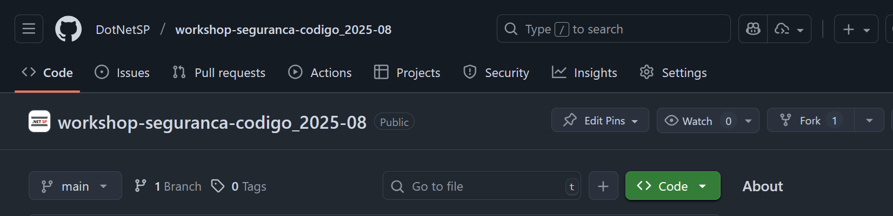
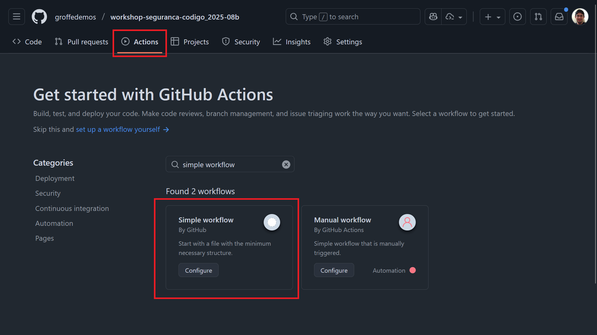
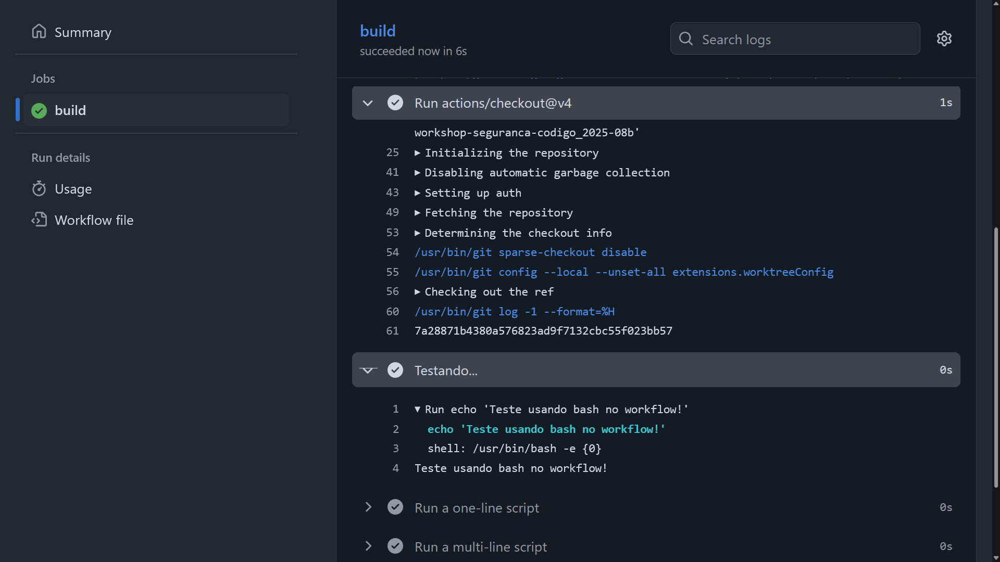
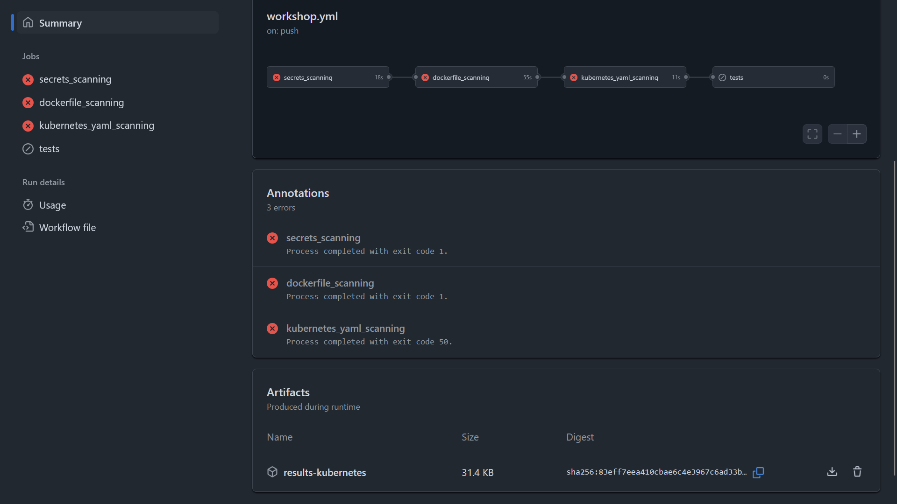
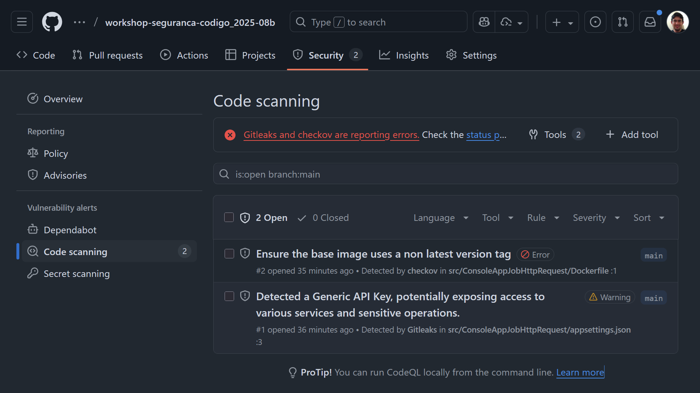
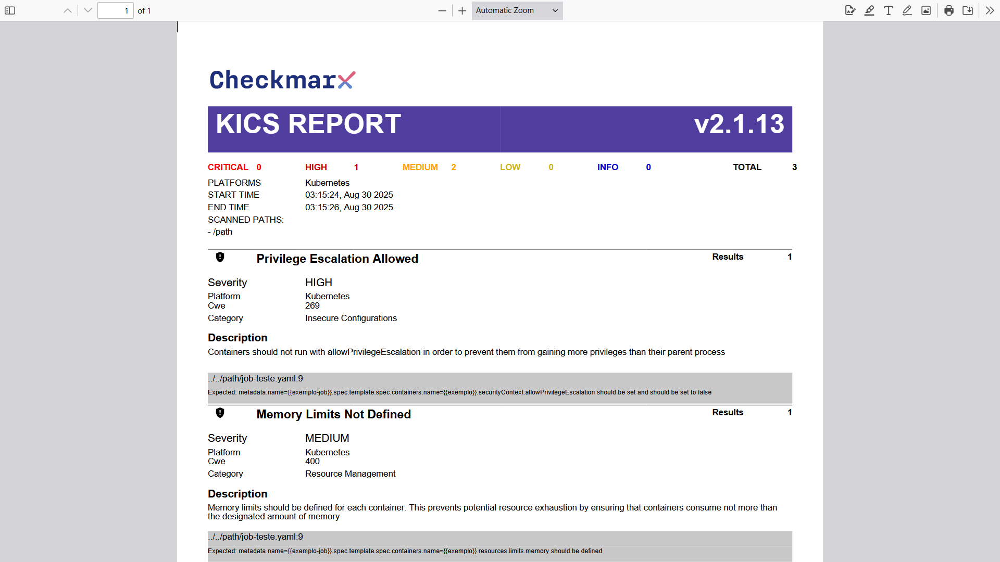
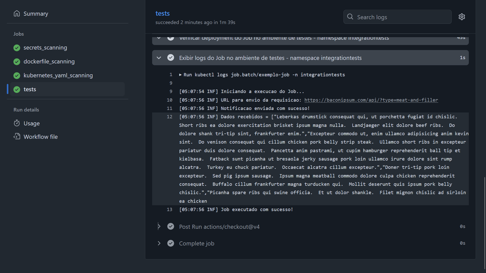

# workshop-seguranca-codigo_2025-08
Conteúdos do Workshop "Implementando Segurança em Código na prática: de aplicações à infraestrutura com GitHub Actions!", realizado durante o Esquenta MVPConf em São Paulo-SP no dia 30/08/2025.

## Implementando Segurança em Código na prática: de aplicações à infraestrutura com GitHub Actions!

Aprenda neste workshop como implementar soluções para análise de código em aplicações e em scripts de infraestrutura na prática, automatizando a execução destas checagens com o GitHub Actions, Linux e diversas ferramentas open source!

Acesse este conteúdo via QRCode e também nos apoiem 🙌, deixando um star ⭐ no repositório do GitHub:


Instrutores (links apontando para o LinkedIn, nos adicionem lá 😉):
- [Renato Groffe](https://www.linkedin.com/in/renatogroffe/)
- [Diego Moreira Matos](https://www.linkedin.com/in/digomatos/)
- [Milton Camara](https://www.linkedin.com/in/miltoncamara/)

Algumas de nossas comunidades técnicas (links para Meetup e YouTube):
- [.NET São Paulo](https://www.meetup.com/dotnet-Sao-Paulo/)
- [Azure Talks](https://www.meetup.com/azure-talks/)
- [DevOps Professionals](https://www.meetup.com/DevOps-Professionals/)
- [Canal .NET](https://www.youtube.com/canaldotnet)
- [Azure na Prática](www.youtube.com/azurenapratica)
- [Coding Night](www.youtube.com/codingnight)

Referências utilizadas:
- [GitHub Actions](https://docs.github.com/en/actions)
- [APIsec University - Certificações online gratuitas](https://www.apisecuniversity.com/)
- [Gitleaks](https://github.com/gitleaks/gitleaks)
- [Checkov - CLI Command Reference](https://www.checkov.io/2.Basics/CLI%20Command%20Reference.html)
- [KICS - CLI Command Reference](https://docs.kics.io/latest/commands/)
- [Uploading a SARIF file to GitHub - GitHub Docs](https://docs.github.com/en/code-security/code-scanning/integrating-with-code-scanning/uploading-a-sarif-file-to-github)

A seguir estão as instruções passo a passo para a execução das atividades práticas.

Na pasta **slides** estão outros materiais, que poderemos abordar durante o workshop havendo uma sobra de tempo.

Para os testes com o Job que será publicado no cluster Kubernetes utilizamos uma das APIs públicas catalogadas em:
https://github.com/public-apis/public-apis

Foi a API Bacon Ipsum 😂:
https://baconipsum.com/json-api/

Através do endpoint:
https://baconipsum.com/api/?type=meat-and-filler

Nosso cluster de testes foi criado via kind, um emulador de Kubernetes muito útil para testes:
https://kind.sigs.k8s.io/

---

### 0. Pré-requisitos

Caso ainda não tenha uma conta no GitHub, comece instalando um aplicativo de One-Time Password (OTP) em seu celular. Recomendamos o Microsoft Authenticator, com versões para Android e iOS: https://www.microsoft.com/pt-br/security/mobile-authenticator-app

Em seguida crie sua conta no GitHub usando um e-mail e nome válidos, com o link a seguir trazendo algumas instruções úteis e lembrando da necessidade se habilitar o MFA (autenticação multifator): https://docs.github.com/pt/get-started/start-your-journey/creating-an-account-on-github


---

### 1. Preparando o repositório para estudos

Faça um fork deste repositório em sua conta pessoal.



---

### 2. Criando a automação

Crie um novo workflow. Uma boa opção para isto é utilizar o template **Simple workflow**:



Faça se achar necessário algumas alterações utilizando código bash e conclua isto com um commit. Seu workflow irá iniciar uma execução automática, sendo possível acompanhar o processamento do mesmo em tempo real:



---

### 3. Acertando o workflow

Substitua o código de seu workflow pelo conteúdo a seguir:

```yaml
name: workshop

on:
  push:
    branches: [ "main" ]
  pull_request:
    branches: [ "main" ]

  workflow_dispatch:

env:
  URL_GITLEAKS_RELEASE: 'https://github.com/gitleaks/gitleaks/releases/download/v8.28.0/gitleaks_8.28.0_linux_x64.tar.gz'
  DIR_DOCKERFILE: './src/ConsoleAppJobHttpRequest'
  DIR_DEVOPS_ARTIFACTS: './devops'
  DIR_TESTS: './tests'

jobs:
  secrets_scanning:
    runs-on: ubuntu-latest

    steps:
      - uses: actions/checkout@v4

      - name: Instalar o Gitleaks
        run: |
          mkdir tmp-gitleaks
          cd tmp-gitleaks
          echo ''
          echo "Url utilizada para download do Gitleaks: ${{ env.URL_GITLEAKS_RELEASE }}"
          echo ''
          curl -L -o gitleaks.tar.gz ${{ env.URL_GITLEAKS_RELEASE }}
          tar -xvzf gitleaks.tar.gz
          ls
          chmod +x gitleaks
          sudo mv gitleaks /usr/local/bin/
          cd ..
          rm -rf tmp-gitleaks

      - name: Testar o Gitleaks
        run: |
          gitleaks --version
          echo ''
          gitleaks --help

      - name: Criar diretorio results
        run: mkdir results

      - name: Executar o Gitleaks no repositorio
        run: |
          curl -L -o ./results/report-basic.tmpl https://raw.githubusercontent.com/gitleaks/gitleaks/refs/heads/master/report_templates/basic.tmpl
          gitleaks dir . \
            --report-format=sarif \
            --report-path=./results/results-secrets.sarif

      - name: Exibir conteudo do diretorio results
        if: always()
        run: |
          cd results
          pwd
          ls -l

      - name: Upload arquivo SARIF file
        if: always()
        uses: github/codeql-action/upload-sarif@v3
        with:
          sarif_file: ./results/results-secrets.sarif
          category: sast-tools
          
  dockerfile_scanning:
    needs: secrets_scanning
    runs-on: ubuntu-latest
    if: always()

    steps:
      - uses: actions/checkout@v4

      - name: Instalar o Checkov via pip
        run: pip install checkov

      - name: Testar a instalacao do Checkov
        run: |
          checkov
          checkov --help

      - name: Criar diretorio results
        run: mkdir results

      - name: Executar analise com o Checkov
        run: |
          echo 'Vulnerabilidades que serao ignoradas ao executar o Checkov:'
          echo '* CKV_DOCKER_2 - Ensure that HEALTHCHECK instructions have been added to container images'
          echo '* CKV_DOCKER_3 - Ensure that the image is not built from a local context'
          echo
          checkov -d ${{ env.DIR_DOCKERFILE }} \
                  --framework dockerfile \
                  --skip-check CKV_DOCKER_2,CKV_DOCKER_3 \
                  -o cli -o sarif \
                  --output-file-path ./results/results-dockerfile.sarif

      - name: Exibir arquivos gerados em /results
        if: always()
        run: |
          cd results
          pwd
          echo
          echo
          ls -l
        
      - name: Upload arquivo SARIF file
        if: always()
        uses: github/codeql-action/upload-sarif@v3
        with:
          sarif_file: ./results/results-dockerfile.sarif
          category: sast-tools

  kubernetes_yaml_scanning:
    needs: dockerfile_scanning
    runs-on: ubuntu-latest
    if: always()

    steps:
      - uses: actions/checkout@v4
      
      - name: Baixa a imagem do KICS
        run: docker pull checkmarx/kics:latest

      - name: Exibir imagens no ambiente local
        run: docker images
        
      - name: Exibir opcoes da linha de comando do KICS
        run: docker run -t checkmarx/kics scan --help

      - name: Configurar permissoes de diretorio para uso do KICS
        run: |
          cd ${{ env.DIR_DEVOPS_ARTIFACTS }}
          echo '**** Diretorio:'
          echo $PWD
          echo ''
          chmod -R 777 .
          echo 'Permissoes apos ajustes'
          ls -ld

      - name: Configurar permissoes de diretorio para uso do KICS
        run: |
          echo 'Vulnerabilidades que serao ignoradas ao executar o KICS:'
          echo '* 611ab018-c4aa-4ba2-b0f6-a448337509a6 - Namespaces like default, kube-system or kube-public should not be used'
          echo '* 48471392-d4d0-47c0-b135-cdec95eb3eef - Service Account Token Automount Not Disabled'
          echo '* f377b83e-bd07-4f48-a591-60c82b14a78b - Seccomp Profile Is Not Configured'
          echo '* dbbc6705-d541-43b0-b166-dd4be8208b54 - NET_RAW Capabilities Not Being Dropped'
          echo '* 02323c00-cdc3-4fdc-a310-4f2b3e7a1660 - Container Running With Low UID'
          echo '* cf34805e-3872-4c08-bf92-6ff7bb0cfadb - Containers should only run as non-root user'
          echo
          cd ${{ env.DIR_DEVOPS_ARTIFACTS }}
          docker run -t -v $PWD:/path checkmarx/kics scan -p /path -o "/path/" \
            --exclude-severities low,info,trace \
            --exclude-queries 611ab018-c4aa-4ba2-b0f6-a448337509a6,48471392-d4d0-47c0-b135-cdec95eb3eef,f377b83e-bd07-4f48-a591-60c82b14a78b,dbbc6705-d541-43b0-b166-dd4be8208b54,02323c00-cdc3-4fdc-a310-4f2b3e7a1660,cf34805e-3872-4c08-bf92-6ff7bb0cfadb \
            --report-formats pdf --output-name results-kubernetes \
            --type Kubernetes

      - name: Exibir arquivos apos execucao do KICS
        if: always()
        run: |
          cd ${{ env.DIR_DEVOPS_ARTIFACTS }}
          pwd
          echo
          echo
          ls -l

      - name: Upload do relatorio PDF do KICS com resultados da analise
        if: always()
        uses: actions/upload-artifact@v4.6.2
        with:
          name: 'results-kubernetes'
          path: ${{ env.DIR_DEVOPS_ARTIFACTS }}/results-kubernetes.pdf

  tests:
    needs: kubernetes_yaml_scanning
    runs-on: ubuntu-latest

    steps:
      - uses: actions/checkout@v4

      - name: Build da imagem da aplicacao
        run: |
          cd ${{ env.DIR_DOCKERFILE }}
          docker build . -t workshop/job-httprequest:$GITHUB_RUN_NUMBER

      - name: Exibir imagens no ambiente apos build
        run: |
          docker images

      - name: Verificar se o kind esta instalado
        run: kind
      
      - name: Criar cluster de testes com o kind
        run: |
          cd ${{ env.DIR_TESTS }}
          kind create cluster --name kind-01 --config=kind-cluster-config-automation-env.yaml

      - name: Testar o cluster Kubernetes criado com o kind
        run: |
          echo ' '
          echo 'Cluster Kubernetes local em funcionamento...'
          echo ' '
          kubectl get services
          
      - name: Exibir containers em execucao
        run: docker container ls

      - name: Carregar imagem no cluster criado com kind
        run: |
          kind load docker-image workshop/job-httprequest:$GITHUB_RUN_NUMBER --name kind-01

      - name: Criar namespace integrationtests
        run: |
          kubectl create namespace integrationtests
          kubectl get namespaces

      - name: Exibir conteudo do arquivo YAML de deployment antes dos ajustes
        run: cat ${{ env.DIR_DEVOPS_ARTIFACTS }}/job-teste.yaml

      - name: Ajustar arquivo YAML de deployment
        uses: cschleiden/replace-tokens@v1
        with:
          files: '["**/job-teste.yaml"]'

      - name: Exibir conteudo do arquivo YAML de deployment apos ajustes
        run: cat ${{ env.DIR_DEVOPS_ARTIFACTS }}/job-teste.yaml

      - name: Deployment do Job no ambiente de testes - namespace integrationtests
        run: |
          cd ${{ env.DIR_DEVOPS_ARTIFACTS }}
          kubectl apply -f job-teste.yaml -n integrationtests

      - name: Verificar deployment do Job no ambiente de testes - namespace integrationtests
        run: |
          kubectl get all -n integrationtests
          kubectl get jobs -n integrationtests
          echo ' '
          echo 'Aguardando a inicialização dos serviços no cluster...'
          echo ' '
          sleep 45s
          kubectl get all -n integrationtests
          kubectl get jobs -n integrationtests

      - name: Exibir logs do Job no ambiente de testes - namespace integrationtests
        run: |
          kubectl logs job.batch/exemplo-job -n integrationtests
```

O scan de secrets, Dockerfile e YAML do Kubernetes apresentará falhas:



Parte dessas falhas pode ser observada em **Security > Code scanning**:



E o restante estará indicado em um arquivo .pdf compactado como um Artifact:



> **Nota:**  
> A partir daqui não incluiremos mais prints, a fim de incentivar um maior engajamento com a realização das atividades práticas.

### 4. Corrigindo problemas no arquivo appsettings.json

Versão do arquivo com problemas:

```yaml
{
    "EndpointRequest": "https://baconipsum.com/api/?type=meat-and-filler",
    "ApiKey": "************"
}
```

Remover no arquivo YAML (**/src/appsettings.json**) a configuração **"ApiKey"** e seu respectivo valor.

```yaml
{
    "EndpointRequest": "https://baconipsum.com/api/?type=meat-and-filler"
}
```

Gravar as alterações e observar uma nova execução do workflow.

---

### 5. Corrigindo problemas no arquivo Dockerfile

Versão do arquivo com problemas:

```yaml
FROM mcr.microsoft.com/dotnet/sdk:latest AS build-env
WORKDIR /app

# Copiar csproj e restaurar dependencias
COPY *.csproj ./
RUN dotnet restore

# Build da aplicacao
COPY . ./
RUN dotnet publish -c Release -o out

# Build da imagem
FROM mcr.microsoft.com/dotnet/runtime:latest
WORKDIR /app
COPY --from=build-env /app/out .
ENTRYPOINT ["dotnet", "ConsoleAppJobHttpRequest.dll"]

```

Versão corrigida:

```yaml
FROM mcr.microsoft.com/dotnet/sdk:9.0.304 AS build-env
WORKDIR /app

# Copiar csproj e restaurar dependencias
COPY *.csproj ./
RUN dotnet restore

# Build da aplicacao
COPY . ./
RUN dotnet publish -c Release -o out

# Build da imagem
FROM mcr.microsoft.com/dotnet/runtime:9.0.8
WORKDIR /app
COPY --from=build-env /app/out .
ENTRYPOINT ["dotnet", "ConsoleAppJobHttpRequest.dll"]
```

Executar novamente.

---

### 6. Corrigindo problemas no arquivo YAML do Kubernetes

Versão do arquivo com problemas:

```yaml
apiVersion: batch/v1
kind: Job
metadata:
  name: exemplo-job
spec:
  template:
    spec:
      containers:
      - name: exemplo
        image: workshop/job-httprequest:#{GITHUB_RUN_NUMBER}#
        env:
        - name: EndpointNotificacao
          value: "https://baconipsum.com/api/?type=all-meat"
      restartPolicy: Never
```

Alterar o arquivo YAML (**/devops/job-teste.yaml**) incluindo as configurações **allowPrivilegeEscalation** e **resources** (limites para execução).

```yaml
apiVersion: batch/v1
kind: Job
metadata:
  name: exemplo-job
spec:
  template:
    spec:
      containers:
      - name: exemplo
        image: workshop/job-httprequest:#{GITHUB_RUN_NUMBER}#
        env:
        - name: EndpointNotificacao
          value: "https://baconipsum.com/api/?type=all-meat"
        resources:
          requests:
            memory: "64Mi"
            cpu: "50m"
          limits:
            memory: "128Mi"
            cpu: "100m"
        securityContext:
          allowPrivilegeEscalation: false
      restartPolicy: Never
```

Gravar as alterações e observar uma nova execução do workflow.

Referências sobre estes tópicos:
- https://kubernetes.io/docs/tasks/configure-pod-container/security-context/
- https://kubernetes.io/docs/concepts/configuration/manage-resources-containers/

---

### 7. Conclusão

Se tudo der certo, teremos uma execução com sinal verde 🟢 em todos os estágios... E uma resposta da API falando sobre bacon e outras iguarias 😂:



> **Nota:**  
> Pedimos desculpas a quem não curte bacon. Você pode até mudar no YAML de Kubernetes para outra API! 😂